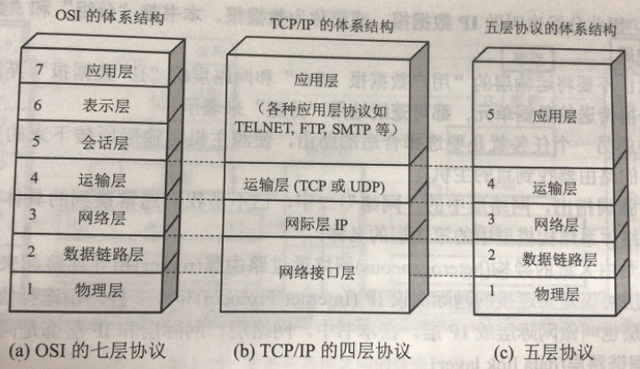
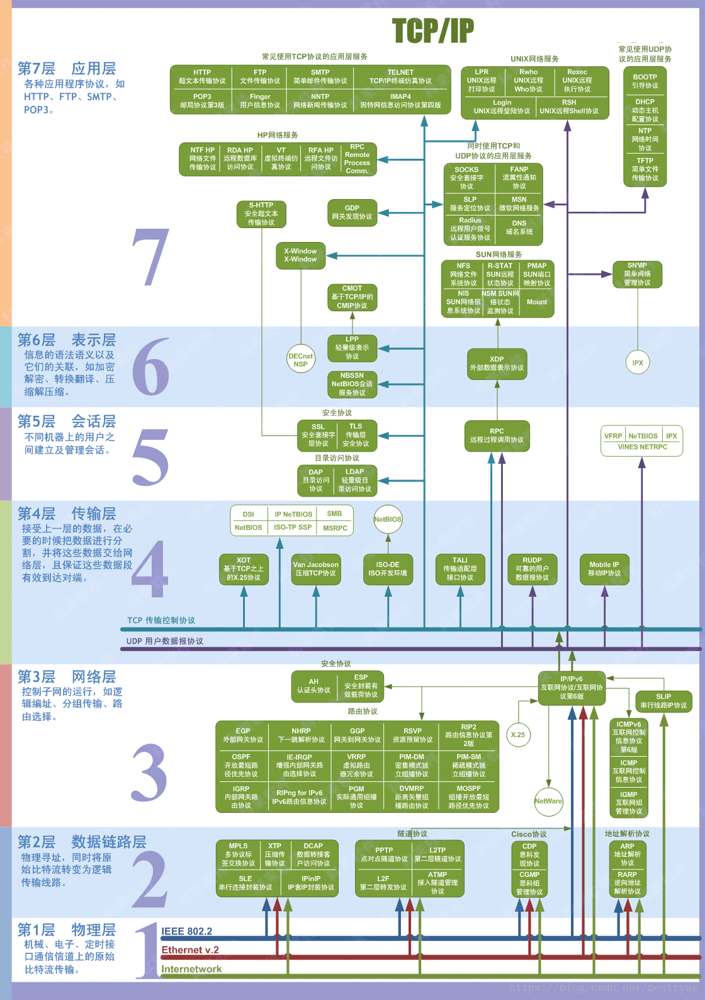
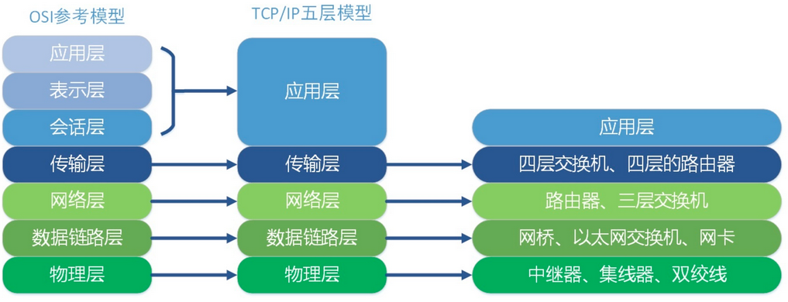
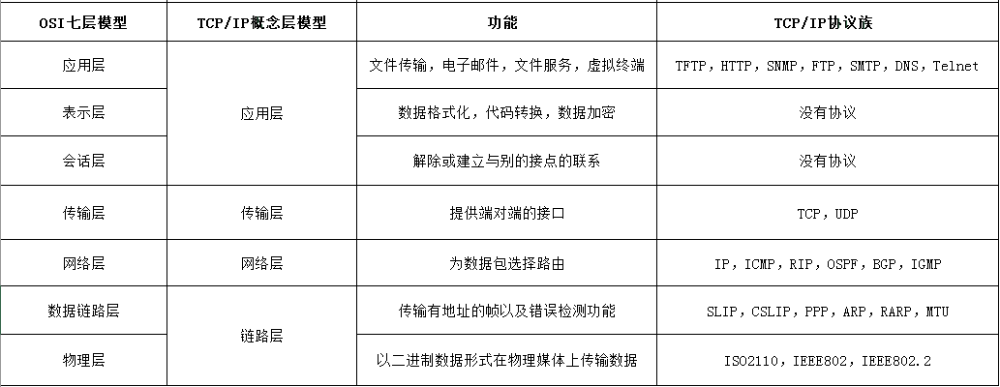
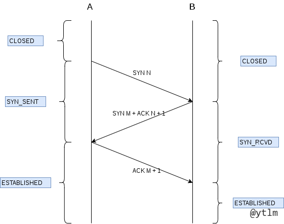
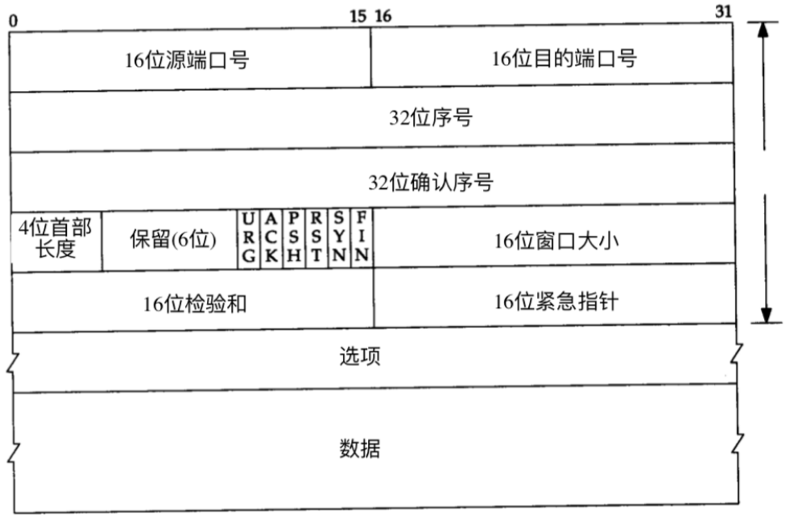
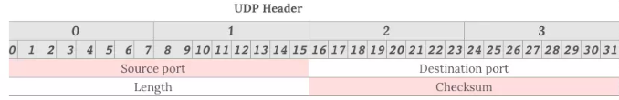
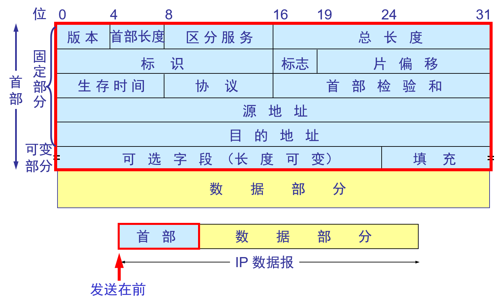
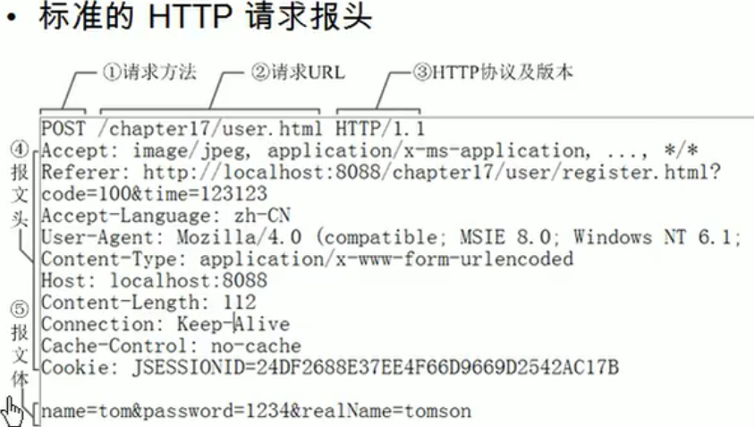
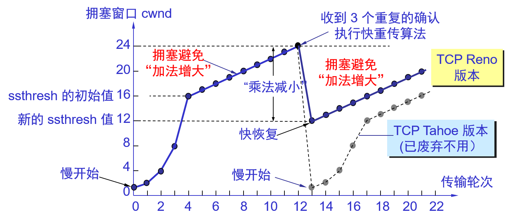

# Java研发工程师
[TOC]

## 一、计算机网络

1. OSI、TCP/IP、五层体系结构联系与区别？

   （1）三种比较？

   

   （2）七层结构细节？

   

   （3）每一层对应的设备？

   

2. **说一说TCP/IP协议簇？**

   

   - 应用层（它是计算机用户，以及各种应用程序和网络之间的接口，其功能是直接向用户提供服务，完成用户希望在网络上完成的各种工作。）
     - SNMP
     - SMTP
   - 传输层（向用户提供可靠的端到端的差错和流量控制，保证报文的正确传输。传输层的作用是向高层屏蔽下层数据通信的细节，即向用户透明地传送报文。）
   - 网络层（通过路由选择算法，为报文或分组通过通信子网选择最适当的路径。）
     - ICMP
     - IGMP
     - RIP
     - BGP
     - OSPF
   - 链路层（通过各种控制协议，将有差错的物理信道变为无差错的、能可靠传输数据帧的数据链路。）
     - ARP，RARP

3. **TCP三次握手的过程？**

   ```
   握手过程可以由客户端调用socket开启，客户端发送SYN和Seq，closed状态变换为SYN_SEND状态，服务器端由LISTEN状态变换为SYN_RECV状态，服务端回送SYN+ACK，客户端接收，客户端状态变为Established，客户端发送ACK，服务端接收到ACK，状态变为Established，至此，TCP三次握手的过程就完成了。
   （1）第一次握手：服务端确定（服务端可以接收数据，客户端可以发送数据）
   （2）第二次握手：客户端确定（服务端可以接收数据，服务端可以接收数据）
   （3）第三次握手：服务端确定（客户端可以接收数据）
   以上，（1）（2）（3）是的双方确定彼此可以接收和发送数据。
   ```

   

4. **TCP四次挥手的过程？**

   ```
   关闭连接的过程可以由服务端和客户端的任何一方发起，发起的一方状态变化为：Established------>FIN_WAIT_1------>FIN_WAIT_2------>TIME_WAIT------>CLOSED; 
   被动关闭的一方的状态变化为Establised------>CLOSE_WAIT------>LAST_ACK------>CLOSED.
   ```

   

5. TCP在三次握手的过程中是如何超时重传的？

   ```
   (1) 如果第一个包，A发送给B请求建立连接的报文(SYN)如果丢掉了，A会周期性的超时重传，直到B发出确认(SYN+ACK)；
   (2) 如果第二个包，B发送给A的确认报文(SYN+ACK)如果丢掉了，B会周期性的超时重传，直到A发出确认(ACK)；
   (3) 如果第三个包，A发送给B的确认报文(ACK)如果丢掉了，
   	- A在发送完确认报文之后，单方面会进入ESTABLISHED的状态，B还是SYN_RCVD状态
   	- 如果此时双方都没有数据需要发送，B会周期性的超时发送(SYN+ACK)，直到收到A的确认报文(ACK)，此时B也进入ESTABLISHED状态，双方可以发送数据；
   	- 如果A有数据发送，A发送的是(ACK+DATA)，B会在收到这个数据包的时候自动切换到ESTABLISHED状态，并接受数据(DATA)；
   	- 如果这个时候B要发送数据，B是发送不了数据的，会周期性的超时重传(SYN+ACK)直到收到A的确认(ACK)B才能发送数据。
   ```

   

6. **为什么要三次握手，四次挥手？**

   （1）为什么要进行三次握手？
   **这是防止已失效的连接请求报文段突然又传送到了B而引发错误。**
   举例，客户端A向服务端B发送数据，受到网络状态的影响，可能A发送的数据B很久以后才收到（实际上A已经通过重传机制重新发送了），当这个阻塞的数据到来的时候，B就会误以为这是一个新的连接，则B将等待A，但是实际上A并没有发起新的请求，这就导致了资源的浪费。
   （2）为什么要进行四次挥手？
   TCP通信是一个双工通信，在结束连接的时候FIN和ACK是分开发送的，A向B发送FIN仅仅表示A不在发送数据，并不表示自己不在接收数据，同理，B向A发送FIN仅仅表示B不在发送数据，但是自己是可以接收数据的。为什么要在发起端加上TIME_WAIT？是为了保证ACK丢失的时候可以重传。
   
7. **在浏览器地址栏输入一个url到浏览器返回页面的过程？**

   ```
   （1）浏览器解析地址
   （2）DNS
   （3）建立TCP连接（三次握手）
   （4）得到服务器响应数据，浏览器进行渲染
   （5）关闭连接（四次挥手）
   ```

   > - 浏览器分析超链指向页面的 URL。
   > - 浏览器向 DNS 请求解析 [www.tsinghua.edu.cn](http://www.tsinghua.edu.cn) 的 IP 地址。
   > - 域名系统 DNS 解析出清华大学服务器的 IP 地址。
   > - 浏览器与服务器建立 TCP 连接
   > - 浏览器发出取文件命令：GET /chn/yxsz/index.htm。
   > - 服务器给出响应，把文件 index.htm 发给浏览器。
   > - TCP 连接释放。
   > - 浏览器显示“清华大学院系设置”文件 index.htm 中的所有文本。

8. **说一说在三次握手的时候可能存在的安全问题？**

   ```
   当第二次握手后，服务端将会进入SYN_RECV状态（又叫做半连接状态），通过伪造客户端的地址，这个时候服务器端一直在等待客户端返回ACK，但是由于地址是伪造的，所以根本就无法收到ACK。当这种伪造的连接数量大的时候就会导致DDOS。
   ```

9. 域名解析

   m.xyz.com需要查找y.abc.com的IP地址：

   > - 主机m.xyz.com向本地域名服务器进行递归查询。
   >
   >   > 主机向本地域名服务器查询时一般使用递归查询。
   >   >
   >   > - **递归查询**：就是如果本地域名服务器没有所需域名的IP地址，本地域名服务器就以客户的方式向其他根域名服务器继续查询，而不是主机自己进行查询。
   >   >
   >   > 本地域名服务器向其他根域名服务器进行查询的时一般使用迭代查询。
   >   >
   >   > - **迭代查询：** 当某个根域名服务器收到本地域名服务器的请求报文时，要么告诉它所需域名的IP地址，要么告诉它下一步应该向哪个服务器发起询问。然后让本地域名服务器自己去查询。
   >
   > - 本地域名服务器迭代查询，先向一个根域名服务器查询。
   >
   > - 根域名服务器告诉本地域名服务器，下一步应该向顶级域名服务器dns.com查询。
   >
   > - 顶级域名服务器dns.com告诉本地域名服务器，下一步查找权限域名服务器：dns.adc.com。
   >
   > - 本地域名服务器向权限域名服务器发起查询。权限域名服务器告诉本地服务器所需的IP地址，本地服务器在告诉给本地主机。

10. **TCP是如何保证可靠传输的？**(分编校丢流拥重超)

   ```
   （1）应用数据被TCP分割成为适合发送的数据块
   （2）TCP将会给每一个包进行编号，接收方会对数据进行排序，将有序的数据传输给应用层。
           序列号：TCP传输时将每个字节的数据都进行了编号，这就是序列号。
           确认应答：TCP传输的过程中，每次接收方收到数据后，都会对传输方进行确认应答。也就是发送ACK报文。这个ACK报文当中带有对应的确认序列号，告诉发送方，接收到了哪些数据，下一次的数据从哪里发。
           序列号的作用不仅仅是应答的作用，有了序列号能够将接收到的数据根据序列号排序，并且去掉重复序列号的数据。这也是TCP传输可靠性的保证之一。
   （3）TCP将会保持首部和数据的校验和，目的是检查数据在传输的过程中是否被修改
   （4）丢弃重复发送的数据
   （5）流量控制：TCP连接的每一方都有一个固定的缓冲空间，TCP的接收端只允许发送端发送接收端缓冲区能够容纳的数据，当接收方来不及处理的时候，能够提示发送端降低发送的速率，防止丢包。（TCP使用的是滑动窗口进行流量控制）
   （6）拥塞控制（当网络阻塞的时候，减少数据的发送，拥塞控制就是防止过多的数据注入到网络中，这样使网络中的路由器或者链路不至于过载。）
   （7）自动重传（为了实现可靠的传输，每发送完一个分组就会停止发送，等待对方确认，确认后再发送下一个分组。）
   （8）超时重传（当TCP发出一个分组后，它将启动一个定时器，等待目的端确认接收，如果不及时，将会重传。）
   ```

   

11. **TCP和UDP之间的区别？**(面头流速可有界)

    | 区别     | TCP                                   | UDP                                                          |
    | -------- | ------------------------------------- | ------------------------------------------------------------ |
    | 面向连接 | 面向连接，**TCP不提供广播和多播服务** | 面向无连接，**UDP支持一对一、多对一、一对多、多对多的交互通信。** |
    | 头部大小 | 头部至少为20个字节                    | 头部为8个字节                                                |
    | 流量控制 | 有流量控制                            | 没有流量控制                                                 |
    | 速度     | TCP速度较慢                           | UDP速度较快                                                  |
    | 可靠性   | 可靠传输                              | 不可靠传输                                                   |
    | 有序     | 有序                                  | 无序                                                         |
    | 界       | TCP有界，通过字节流传输               | UDP无界，每一个包是单独传输的，发送方的UDP对应用程序交下来的报文添加首部后直接交付给IP层。UDP对应用层交下来的报文，既不合并，也不拆分，而是保留这些报文的边界。 |
    | 适用场景 | 视频                                  | 文件传输                                                     |

    

12. **post和get的区别？**

    | 区别   | POST                                                   | GET                               |
    | ------ | ------------------------------------------------------ | --------------------------------- |
    | 可见性 | 数据在url中不可见                                      | 参数在url中可见                   |
    | 长度   | 没有长度限制                                           | 有长度限制                        |
    | 编码   | application/x-www-form-urlencoded, multipart/form-data | application/x-www-form-urlencoded |
    | 缓存   | 不支持                                                 | 支持                              |
    | 安全性 | 相对安全                                               | 相对不安全                        |

     

13. **在TCP和UDP之上都有哪些应用层的协议？**

    ```
    TCP：HTTP，HTTPS，SMTP（简单邮件传输协议），POP3，SSH
    UDP：DNS，Telnet，SNMP（简单网络管理协议），IGMP（网络组管理协议）,RIP(路由信息协议)，DHCP（动态主机设置协议）
    ```

    

14. **HTTPS握手的过程？**

    ```
    （1）客户端给出一个协议版本号、一个客户端生成的随机数（Client random）以及客户端支持的加密算法。（客户端发送了三件东西）
    （2）服务端确认双方使用的加密算法，并且给出数字证书，以及一个随机数（server random）。（服务端发送了两件东西）
    （3）客户端确认数字证书有效，然后生成一个新的随机数（Premaster secret），并且使用数字证书中的公钥，加密这个随机数，将其发送给服务端。（客户端发送了一个非对称加密的随机数）
    （4）服务端使用自己的私钥，获取来自客户端的加密随机数（Premaster secret）。（服务端使用非对称加密算法进行解密）
    （5）客户端和服务端根据约定的加密方法，使用前面的三个随机数，生成对话密钥（session key），用来加密整个会话。（服务端使用对称密钥会话）
    ```

    

15. **TCP头部，UDP头部比较？**

    （1）TCP头部至少由20个字节构成（最长60个），如下图：

    

    （2）UDP头部由8个字节构成，如下图：

    

16. IP头部

    

17. **HTTP请求，HTTP响应，字段？**

    （1）HTTP请求

    - 请求行
      - 方法，url，协议版本
    - 请求首部字段
    - 空行（这一个空行一定存在）
    - 内容实体

    

    （2）HTTP响应

    - 响应行
      - 协议版本，响应状态码，原因短语
    - 响应首部字段
    - 空行
    - 内容实体

    （3）字段

    - 通用头（通用头域包含请求和响应消息都支持的头域，通用头域包含缓存头部Cache-Control、Pragma及信息性头部Connection、Date、Transfer-Encoding、Update、Via）

    | 名字                  | 含义                                                         |
    | :-------------------- | ------------------------------------------------------------ |
    | **Date**              | Date头域表示消息发送的时间，服务器响应中要包含这个头部，因为缓存在评估响应的新鲜度时要用到，其时间的描述格式由RFC822定义。例如，Date:Mon,31 Dec 2001 04:25:57 GMT。Date描述的时间表示世界标准时，换算成本地时间，需要知道用户所在的时区。 |
    | **Transfer-Encoding** | WEB 服务器表明自己对本响应消息体（不是消息体里面的对象）作了怎样的编码，比如是否分块（chunked），例如：Transfer-Encoding: chunked |
    | **Pragma**            | Pragma头域用来包含实现特定的指令，最常用的是Pragma:no-cache。在HTTP/1.1协议中，它的含义和Cache- Control:no-cache相同。 |
    | **Connection**        | Connection表示是否需要持久连接。                             |
    | **Cache-Control**     | Cache-Control指定请求和响应遵循的缓存机制。在请求消息或响应消息中设置 Cache-Control并不会修改另一个消息处理过程中的缓存处理过程。请求时的缓存指令包括no-cache、no-store、max-age、max-stale、min-fresh、only-if-cached，响应消息中的指令包括public、private、no-cache、no-store、no-transform、must-revalidate、proxy-revalidate、max-age。 |
    | **Upgrade**           | 它可以指定另一种可能完全不同的协议，如HTTP/1.1客户端可以向服务器发送一条HTTP/1.0请求，其中包含值为“HTTP/1.1”的Update头部，这样客户端就可以测试一下服务器是否也使用HTTP/1.1了。 |
    | **Via**               | 列出从客户端到 OCS 或者相反方向的响应经过了哪些代理服务器，他们用什么协议（和版本）发送的请求。 |

    - HTTP请求头（请求头用于说明是谁或什么在发送请求、请求源于何处，或者客户端的喜好及能力。服务器可以根据请求头部给出的客户端信息，试着为客户端提供更好的响应。）

    | 名字                    | 含义                                                         |
    | ----------------------- | ------------------------------------------------------------ |
    | **Accept**              | 告诉WEB服务器自己接受什么介质类型，*/* 表示任何类型，type/* 表示该类型下的所有子类型，type/sub-type。 |
    | **Accept-Charset**      | 浏览器告诉服务器自己能接收的字符集。                         |
    | **Accept-Encoding**     | 浏览器申明自己接收的编码方法，通常指定压缩方法，是否支持压缩，支持什么压缩方法（gzip，deflate）。 |
    | **Accept-Language**     | 浏览器申明自己接收的语言。语言跟字符集的区别：中文是语言，中文有多种字符集，比如big5，gb2312，gbk等等。 |
    | **Authorization**       | 当客户端接收到来自WEB服务器的 WWW-Authenticate 响应时，用该头部来回应自己的身份验证信息给WEB服务器。 |
    | **If-Match**            | 如果对象的 ETag 没有改变，其实也就意味著对象没有改变，才执行请求的动作，获取文档。 |
    | **If-None-Match**       | 如果对象的 ETag 改变了，其实也就意味著对象也改变了，才执行请求的动作，获取文档。 |
    | **If-Modified-Since**   | 如果请求的对象在该头部指定的时间之后修改了，才执行请求的动作（比如返回对象），否则返回代码304，告诉浏览器该对象没有修改。例如：If-Modified-Since：Thu, 10 Apr 2008 09:14:42 GMT |
    | **If-Unmodified-Since** | 如果请求的对象在该头部指定的时间之后没修改过，才执行请求的动作（比如返回对象）。 |
    | **If-Range**            | 浏览器告诉 WEB 服务器，如果我请求的对象没有改变，就把我缺少的部分给我，如果对象改变了，就把整个对象给我。浏览器通过发送请求对象的ETag 或者自己所知道的最后修改时间给 WEB 服务器，让其判断对象是否改变了。总是跟 Range 头部一起使用。 |
    | **Range**               | 浏览器（比如 Flashget 多线程下载时）告诉 WEB 服务器自己想取对象的哪部分。例如：Range: bytes=1173546 |
    | **Proxy-Authenticate**  | 代理服务器响应浏览器，要求其提供代理身份验证信息。           |
    | **Proxy-Authorization** | 浏览器响应代理服务器的身份验证请求，提供自己的身份信息。     |
    | **Host**                | 客户端指定自己想访问的WEB服务器的域名/IP 地址和端口号。如Host：rss.sina.com.cn |
    | **Referer**             | 浏览器向WEB 服务器表明自己是从哪个网页URL获得点击当前请求中的网址/URL，例如：Referer：[http://www.jb51.net](http://www.jb51.net/) |
    | **User-Agent**          | 浏览器表明自己的身份（是哪种浏览器）。例如：User-Agent：Mozilla/5.0 (Windows; U; Windows NT 5.1; zh-CN;rv:1.8.1.14) Gecko/20080404 Firefox/2.0.0.14 |

    - HTTP响应头（响应头向客户端提供一些额外信息，比如谁在发送响应、响应者的功能，甚至与响应相关的一些特殊指令。这些头部有助于客户端处理响应，并在将来发起更好的请求。）

    | 名字              | 含义                                                         |
    | ----------------- | ------------------------------------------------------------ |
    | **Age**           | 当代理服务器用自己缓存的实体去响应请求时，用该头部表明该实体从产生到现在经过多长时间了。 |
    | **Server**        | WEB 服务器表明自己是什么软件及版本等信息。例如：Server：Apache/2.0.61 (Unix) |
    | **Accept-Ranges** | WEB服务器表明自己是否接受获取其某个实体的一部分（比如文件的一部分）的请求。bytes：表示接受，none：表示不接受。 |
    | **Vary**          | WEB服务器用该头部的内容告诉 Cache 服务器，在什么条件下才能用本响应所返回的对象响应后续的请求。假如源WEB服务器在接到第一个请求消息时，其响应消息的头部为：Content-Encoding:gzip; Vary: Content-Encoding，那么Cache服务器会分析后续请求消息的头部，检查其Accept-Encoding，是否跟先前响应的Vary头部值一致，即是否使用相同的内容编码方法，这样就可以防止Cache服务器用自己Cache里面压缩后的实体响应给不具备解压能力的浏览器。例如：Vary：Accept-Encoding。 |

    - HTTP实体头部（实体头部提供了有关实体及其内容的大量信息，从有关对象类型的信息，到能够对资源使用的各种有效的请求方法。总之，实体头部可以告知接收者它在对什么进行处理。请求消息和响应消息都可以包含实体信息，实体信息一般由实体头域和实体组成。实体头域包含关于实体的原信息，实体头包括信息性头部Allow、Location，内容头部Content-Base、Content-Encoding、Content-Language、Content-Length、Content-Location、Content-MD5、Content-Range、Content-Type，缓存头部Etag、Expires、Last-Modified、extension-header。）

    | 名字                 | 含义                                                         |
    | -------------------- | ------------------------------------------------------------ |
    | **Allow**            | 服务器支持哪些请求方法（如GET、POST等）。                    |
    | **Location**         | 表示客户应当到哪里去提取文档，用于将接收端定位到资源的位置（URL）上。Location通常不是直接设置的，而是通过HttpServletResponse的sendRedirect方法，该方法同时设置状态代码为302。 |
    | **Content-Base**     | 解析主体中的相对URL时使用的基础URL。                         |
    | **Content-Encoding** | WEB服务器表明自己使用了什么压缩方法（gzip，deflate）压缩响应中的对象。例如：Content-Encoding：gzip |
    | **Content-Language** | WEB 服务器告诉浏览器理解主体时最适宜使用的自然语言。         |
    | **Content-Length**   | WEB服务器告诉浏览器自己响应的对象的长度或尺寸，例如：Content-Length: 26012 |
    | **Content-Location** | 资源实际所处的位置。                                         |
    | **Content-MD5**      | 主体的MD5校验和。                                            |
    | **Content-Range**    | 实体头用于指定整个实体中的一部分的插入位置，他也指示了整个实体的长度。在服务器向客户返回一个部分响应，它必须描述响应覆盖的范围和整个实体长度。一般格式：Content-Range:bytes-unitSPfirst-byte-pos-last-byte-pos/entity-legth。例如，传送头500个字节次字段的形式：Content-Range:bytes0-499/1234如果一个http消息包含此节（例如，对范围请求的响应或对一系列范围的重叠请求），Content-Range表示传送的范围，Content-Length表示实际传送的字节数。 |
    | **Content-Type**     | WEB 服务器告诉浏览器自己响应的对象的类型。例如：Content-Type：application/xml |
    | **Etag**             | 就是一个对象（比如URL）的标志值，就一个对象而言，比如一个html文件，如果被修改了，其Etag也会别修改，所以，ETag的作用跟Last-Modified的作用差不多，主要供WEB服务器判断一个对象是否改变了。比如前一次请求某个html文件时，获得了其<br/>ETag，当这次又请求这个文件时，浏览器就会把先前获得ETag值发送给WEB服务器，然后WEB服务器会把这个ETag跟该文件的当前ETag进行对比，然后就知道这个文件有没有改变了。 |
    | **Expires**          | WEB服务器表明该实体将在什么时候过期，对于过期了的对象，只有在跟WEB服务器验证了其有效性后，才能用来响应客户请求。是 HTTP/1.0 的头部。例如：Expires：Sat, 23 May 2009 10:02:12 GMT |
    | **Last-Modified**    | WEB服务器认为对象的最后修改时间，比如文件的最后修改时间，动态页面的最后产生时间等等。例如：Last-Modified：Tue, 06 May 2008 02:42:43 GMT |

    

18. HTTP1.0，HTTP1.1，HTTP2.0之间的区别？

    ```
    （1）HTTP1.0：
    - 无法复用连接
    - 对头阻塞（head of line blocking）
    
    （2）HTTP1.1：
    - 长连接（在头部加入了connection：keep-alive）
    - 管道化（将请求队列移动到服务端队列）
    - 缓存机制（引入了新的字段cache-control，支持断点重传）
    - 增加了host字段（使得一个服务器可创建多个站点）
    （3）HTTP2.0：
    - 二进制分帧
    - 多路复用（消息由一个帧或者多个帧组成，可以乱序进行发送，之后使用帧的stream id进行重组，二进制分帧使得多路复用成为可能，多路复用实现真正的并发）
    - 头部压缩，通信双方保存header filed表
    - 服务器推送（不用客户端进行明确请求）
    ```

    **新HTTP1.0与HTTP1.1区别：**

    > HTTP1.0最早在网页中使用是在1996年，那个时候只是使用一些较为简单的网页上和网络请求上，而HTTP1.1则在1999年才开始广泛应用于现在的各大浏览器网络请求中，同时HTTP1.1也是当前使用最为广泛的HTTP协议。 主要区别主要体现在：
    >
    > - **缓存处理**，在HTTP1.0中主要使用header里的If-Modified-Since,Expires来做为缓存判断的标准，HTTP1.1则引入了更多的缓存控制策略例如Entity  tag，If-Unmodified-Since, If-Match, If-None-Match等更多可供选择的缓存头来控制缓存策略。
    > - **带宽优化及网络连接的使用**，HTTP1.0中，存在一些浪费带宽的现象，例如客户端只是需要某个对象的一部分，而服务器却将整个对象送过来了，并且不支持断点续传功能，HTTP1.1则在请求头引入了range头域，它允许只请求资源的某个部分，即返回码是206（Partial  Content），这样就方便了开发者自由的选择以便于充分利用带宽和连接。
    > - **错误通知的管理**，在HTTP1.1中新增了24个错误状态响应码，如409（Conflict）表示请求的资源与资源的当前状态发生冲突；410（Gone）表示服务器上的某个资源被永久性的删除。
    > - **Host头处理**，在HTTP1.0中认为每台服务器都绑定一个唯一的IP地址，因此，请求消息中的URL并没有传递主机名（hostname）。但随着虚拟主机技术的发展，在一台物理服务器上可以存在多个虚拟主机（Multi-homed  Web  Servers），并且它们共享一个IP地址。HTTP1.1的请求消息和响应消息都应支持Host头域，且请求消息中如果没有Host头域会报告一个错误（400  Bad Request）。
    > - **长连接、持续连接**，HTTP  1.1支持长连接（PersistentConnection）和请求的流水线（Pipelining）处理，在一个TCP连接上可以传送多个HTTP请求和响应，减少了建立和关闭连接的消耗和延迟，在HTTP1.1中默认开启Connection：  keep-alive，一定程度上弥补了HTTP1.0每次请求都要创建连接的缺点。

    **HTTP1.1与HTTP2.0的区别：**

    > - **新的二进制格式**（Binary  Format），HTTP1.x的解析是基于文本。基于文本协议的格式解析存在天然缺陷，文本的表现形式有多样性，要做到健壮性考虑的场景必然很多，二进制则不同，只认0和1的组合。基于这种考虑HTTP2.0的协议解析决定采用二进制格式，实现方便且健壮。
    > - **多路复用**（MultiPlexing），即连接共享，即每一个request都是是用作连接共享机制的。一个request对应一个id，这样一个连接上可以有多个request，每个连接的request可以随机的混杂在一起，接收方可以根据request的  id将request再归属到各自不同的服务端请求里面。
    > - **header压缩**，如上文中所言，对前面提到过HTTP1.x的header带有大量信息，而且每次都要重复发送，HTTP2.0使用encoder来减少需要传输的header大小，通讯双方各自cache一份header  fields表，既避免了重复header的传输，又减小了需要传输的大小。
    > - **服务端推送**（server push），同SPDY一样，HTTP2.0也具有server push功能

19. **cookie和session的区别？**

    （1）cookie数据存放在客户的浏览器上，session存放在服务器上。

    （2）cookie不是安全的，别人可以分析存放在本地的cookie进行cookie欺骗。

    （3）session会一定时间内存放在服务器上，当访问次数增多的时候，会影响性能。

    （4）单个cookie保存的数据不会超过4K，很多浏览器限制一个站点的cookie数目不超过20个。

20. **状态码？**

    （1）概括：

    |      | 类别                             | 原因短语                   |
    | ---- | -------------------------------- | -------------------------- |
    | 1XX  | Informational（信息状态码）      | 接收的请求正在处理         |
    | 2XX  | Success（成功状态码）            | 请求正常处理完毕           |
    | 3XX  | Redirection（重定向状态码）      | 需要进行附加操作以完成请求 |
    | 4XX  | Client Error（客户端错误状态码） | 服务器无法处理请求         |
    | 5XX  | Server Error（服务器错误状态码） | 服务器处理请求出错         |

    （2）细节

    | 状态码 | 状态码英文名称                  | 中文描述                                                     |
    | ------ | ------------------------------- | ------------------------------------------------------------ |
    | 100    | Continue                        | 继续。客户端应继续其请求                                     |
    | 101    | Switching Protocols             | 切换协议。服务器根据客户端的请求切换协议。只能切换到更高级的协议，例如，切换到HTTP的新版本协议 |
    |        |                                 |                                                              |
    | 200    | OK                              | 请求成功。一般用于GET与POST请求                              |
    | 201    | Created                         | 已创建。成功请求并创建了新的资源                             |
    | 202    | Accepted                        | 已接受。已经接受请求，但未处理完成                           |
    | 203    | Non-Authoritative Information   | 非授权信息。请求成功。但返回的meta信息不在原始的服务器，而是一个副本 |
    | 204    | No Content                      | 无内容。服务器成功处理，但未返回内容。在未更新网页的情况下，可确保浏览器继续显示当前文档 |
    | 205    | Reset Content                   | 重置内容。服务器处理成功，用户终端（例如：浏览器）应重置文档视图。可通过此返回码清除浏览器的表单域 |
    | 206    | Partial Content                 | 部分内容。服务器成功处理了部分GET请求                        |
    |        |                                 |                                                              |
    | 300    | Multiple Choices                | 多种选择。请求的资源可包括多个位置，相应可返回一个资源特征与地址的列表用于用户终端（例如：浏览器）选择 |
    | 301    | Moved Permanently               | 永久移动。请求的资源已被永久的移动到新URI，返回信息会包括新的URI，浏览器会自动定向到新URI。今后任何新的请求都应使用新的URI代替 |
    | 302    | Found                           | 临时移动。与301类似。但资源只是临时被移动。客户端应继续使用原有URI |
    | 303    | See Other                       | 查看其它地址。与301类似。使用GET和POST请求查看               |
    | 304    | Not Modified                    | 未修改。所请求的资源未修改，服务器返回此状态码时，不会返回任何资源。客户端通常会缓存访问过的资源，通过提供一个头信息指出客户端希望只返回在指定日期之后修改的资源 |
    | 305    | Use Proxy                       | 使用代理。所请求的资源必须通过代理访问                       |
    | 306    | Unused                          | 已经被废弃的HTTP状态码                                       |
    | 307    | Temporary Redirect              | 临时重定向。与302类似。使用GET请求重定向                     |
    |        |                                 |                                                              |
    | 400    | Bad Request                     | 客户端请求的语法错误，服务器无法理解                         |
    | 401    | Unauthorized                    | 请求要求用户的身份认证                                       |
    | 402    | Payment Required                | 保留，将来使用                                               |
    | 403    | Forbidden                       | 服务器理解请求客户端的请求，但是拒绝执行此请求               |
    | 404    | Not Found                       | 服务器无法根据客户端的请求找到资源（网页）。通过此代码，网站设计人员可设置"您所请求的资源无法找到"的个性页面 |
    | 405    | Method Not Allowed              | 客户端请求中的方法被禁止                                     |
    | 406    | Not Acceptable                  | 服务器无法根据客户端请求的内容特性完成请求                   |
    | 407    | Proxy Authentication Required   | 请求要求代理的身份认证，与401类似，但请求者应当使用代理进行授权 |
    | 408    | Request Time-out                | 服务器等待客户端发送的请求时间过长，超时                     |
    | 409    | Conflict                        | 服务器完成客户端的 PUT 请求时可能返回此代码，服务器处理请求时发生了冲突 |
    | 410    | Gone                            | 客户端请求的资源已经不存在。410不同于404，如果资源以前有现在被永久删除了可使用410代码，网站设计人员可通过301代码指定资源的新位置 |
    | 411    | Length Required                 | 服务器无法处理客户端发送的不带Content-Length的请求信息       |
    | 412    | Precondition Failed             | 客户端请求信息的先决条件错误                                 |
    | 413    | Request Entity Too Large        | 由于请求的实体过大，服务器无法处理，因此拒绝请求。为防止客户端的连续请求，服务器可能会关闭连接。如果只是服务器暂时无法处理，则会包含一个Retry-After的响应信息 |
    | 414    | Request-URI Too Large           | 请求的URI过长（URI通常为网址），服务器无法处理               |
    | 415    | Unsupported Media Type          | 服务器无法处理请求附带的媒体格式                             |
    | 416    | Requested range not satisfiable | 客户端请求的范围无效                                         |
    | 417    | Expectation Failed              | 服务器无法满足Expect的请求头信息                             |
    |        |                                 |                                                              |
    | 500    | Internal Server Error           | 服务器内部错误，无法完成请求                                 |
    | 501    | Not Implemented                 | 服务器不支持请求的功能，无法完成请求                         |
    | 502    | Bad Gateway                     | 作为网关或者代理工作的服务器尝试执行请求时，从远程服务器接收到了一个无效的响应 |
    | 503    | Service Unavailable             | 由于超载或系统维护，服务器暂时的无法处理客户端的请求。延时的长度可包含在服务器的Retry-After头信息中 |
    | 504    | Gateway Time-out                | 充当网关或代理的服务器，未及时从远端服务器获取请求           |
    | 505    | HTTP Version not supported      | 服务器不支持请求的HTTP协议的版本，无法完成处理               |

    **1XX——表示通知信息，如请求收到了或正在进行处理**

    **2XX——表明请求被正常处理了**

    > - 200 OK：请求已正常处理。
    > - 204 No Content：请求处理成功，但没有任何资源可以返回给客户端，一般在只需要从客户端往服务器发送信息，而对客户端不需要发送新信息内容的情况下使用。
    > - 206 Partial Content：是对资源某一部分的请求，该状态码表示客户端进行了范围请求，而服务器成功执行了这部分的GET请求。响应报文中包含由Content-Range指定范围的实体内容。

    **3XX——表明浏览器需要执行某些特殊的处理以正确处理请求**

    > - 301 Moved Permanently：资源的uri已更新，你也更新下你的书签引用吧。永久性重定向，请求的资源已经被分配了新的URI，以后应使用资源现在所指的URI。
    > - 302 Found：资源的URI已临时定位到其他位置了，姑且算你已经知道了这个情况了。临时性重定向。和301相似，但302代表的资源不是永久性移动，只是临时性性质的。换句话说，已移动的资源对应的URI将来还有可能发生改变。
    > - 303  See  Other：资源的URI已更新，你是否能临时按新的URI访问。该状态码表示由于请求对应的资源存在着另一个URL，应使用GET方法定向获取请求的资源。303状态码和302状态码有着相同的功能，但303状态码明确表示客户端应当采用GET方法获取资源，这点与302状态码有区别。当301,302,303响应状态码返回时，几乎所有的浏览器都会把POST改成GET，并删除请求报文内的主体，之后请求会自动再次发送。
    > - 304  Not  Modified：资源已找到，但未符合条件请求。该状态码表示客户端发送附带条件的请求时（采用GET方法的请求报文中包含If-Match，If-Modified-Since，If-None-Match，If-Range，If-Unmodified-Since中任一首部）服务端允许请求访问资源，但因发生请求未满足条件的情况后，直接返回304。
    > - 307 Temporary Redirect：临时重定向。与302有相同的含义。

    **4XX——表明客户端是发生错误的原因所在。**

    > - 400 Bad Request：服务器端无法理解客户端发送的请求，请求报文中可能存在语法错误。
    > - 401 Unauthorized：该状态码表示发送的请求需要有通过HTTP认证（BASIC认证，DIGEST认证）的认证信息。
    > - 403 Forbidden：不允许访问那个资源。该状态码表明对请求资源的访问被服务器拒绝了。（权限，未授权IP等）
    > - 404 Not Found：服务器上没有请求的资源。路径错误等。

    **5XX——服务器本身发生错误**

    > - 500 Internal Server Error：貌似内部资源出故障了。该状态码表明服务器端在执行请求时发生了错误。也有可能是web应用存在bug或某些临时故障。
    > - 503 Service Unavailable：抱歉，我现在正在忙着。该状态码表明服务器暂时处于超负载或正在停机维护，现在无法处理请求。

21. TCP是如何实现面向连接的？面向连接和非面向连接的区别？

    （1）状态和序列号，以及错误校验。描述TCP和UDP头之间的差异！

22. TCP的拥塞控制？（重传就可能导致拥塞）

    （1）慢启动？

    （2）拥塞避免？

    （3）快重传？

    （4）快恢复？

    TCP通过**慢启动、拥塞避免、快重传以及快恢复**这四个算法来进行拥塞控制：

    > - **慢启动：**一开始先设置一个比较小的拥塞窗口值cwnd（报文段的倍数），然后进行数据传输，每收到一个报文段的确认，我们就将**cwnd+1**，这样下来，cwnd总体上是乘以**2^n**的倍数增长。（慢启动非增长速度慢，只是增长的初始基数比较小）
    > - **拥塞避免：** 因为慢启动算法的增长比较快，当cwnd = ssthresh（预先设置好的门限值）时，我们启动拥塞避免算法，窗口值开始线性增长。
    >
    > > 随着拥塞避免算法的进行，网络出现超时的情况（这时判断为**拥塞出现**）。这时将cwnd降为一开始的值，重新进行**慢开始-拥塞避免**，并且此时的门限值设为出现拥塞时的cwnd的一半。
    >
    > - **快重传：** 快重传的目的是为了让发送方尽早知道某个报文段的丢失。如何知道呢？**当我们重复收到某一个报文段的3次确认时，我们就可以判断，它的下一个报文段可能出现了丢失**。这时我们启动快重传算法，立即重传丢失的报文段。
    > - **快恢复：** 上面快重传算法的启动只是因为个别报文段的丢失，我们这时并不判断为网络拥塞，而是启动快恢复算法。我们将cwnd=ssthresh=当前cwnd的一半，并且开始拥塞避免算法。
    >
    > > 当然，也有的快恢复算法是将当前拥塞窗口再增大3个报文段的值，因为既然收到了3个重复的ACK，则说明有三个分组已经离开了网络，不在占用网络资源而是停留在对方缓存当中，可以适当将窗口值增大。

    

23. TCP的流量控制？

    滑动窗口协议

24. 重传算法？

    SACK方法

    - 为了解决快速重传的缺点，一种更好的SACK重传策略被提出
    - 基于快速重传，同时在tcp头里加了一个SACK的东西
    - 解决了什么问题：客户端应该发送哪些超时包的问题

25. 路由算法？

    （1）路由：找到任意两个节点之间开销最小的路径。

    （2）距离向量，链路状态

    - 距离向量：网络中没有任何一个节点知道整张表的信息，自己只知道它自己的路由表的内容。好处：所有的节点在没有任何集中授权的额情况下取得网络的一致视图。（RIP协议）
    - 链路状态：每一个节点都有足够的信息构建完整的网络映象。（OSPF协议，开放最短路径优先），路由的计算采用迪杰特斯拉算法进行计算。

26. IP数据报格式？

    

27. ABC类地址

    > - A、B、C类IP地址的网络号字段分别是1、2、3个字节长，而在网络号的1-3位是类别位，分别是：0、10、110。
    > - A、B、C类IP地址的主机号字段分别为3、2、1个字节。
    > - A、B、C类IP地址是单播地址，D类IP地址（前四位为1110）为多播地址，E类IP地址（前四位1111）保留为以后使用。
    > - A类地址的网络号中：全0和127是不指派的；主机号中：全0代表本主机所连接的单个网络地址，全1代表网络上的所有主机，也是不指派的。
    > - B类IP地址网络号中：**128.0.0.0不指派**；主机号中：全0和全1也不指派。
    > - C类IP地址网络号中：**192.0.0.0不指派**；主机号中：全0和全1也不指派。

28. 端口号

    | 应用程序   | FTP  | TELNET | SMTP | DNS  | TFTP | HTTP | SNMP | SNMP(trap) | HTTPS |
    | ---------- | ---- | ------ | ---- | ---- | ---- | ---- | ---- | ---------- | ----- |
    | 熟知端口号 | 21   | 23     | 25   | 53   | 69   | 80   | 161  | 162        | 443   |

29. 滑动窗口（解决的是速率不匹配问题）

    - 解决了什么问题：发送方和接收方速率不匹配时，保证可靠传输和包乱序的问题

    - 机制：接收方根据目前缓冲区大小，通知发送方目前能接收的最大值。发送方根据接收方的处理能力来发送数据。通过这种协调机制，防止接收端处理不过来。

    - 窗口大小：接收方发给发送端的这个值称为窗口大小

30. 拥塞窗口（控制的是发送方）

    - 解决什么问题：发送方发送速度过快，导致中转路由器拥堵的问题
    - 机制：发送方增加一个拥塞窗口（cwnd），每次受到ack，窗口值加1。发送时，取拥塞窗口和接收方发来的窗口大小取最小值发送
    - 起到发送方流量控制的作用

31. 细节

    - MIME (*M*ultipurpose *I*nternet *M*ail *E*xtensions) 是描述消息内容类型的因特网标准。
    - Request For Comments（*RFC*），是一系列以编号排定的文件。文件收集了有关互联网相关信息，以及UNIX和互联网社区的软件文件。
    - RIP使用UDP，OSPF使用IP,而BGP使用TCP。
      - OSPF本身提供主从协商机制，可以保证可靠的传输，另外全网路由器保持着同样的一个LSDB（链路状态数据库），当拓扑发生变化时，需要携带的变更信息较少，
      - 通过IP协议即可完成RIP协议采用UDP是因为RIP每周期需全网组播路由信息，路由信息数目较大，故使用UDP协议可以提高效率
      - BGP为边界网关协议，因携带的路由信息较多，且可能跨不同网络传送路由信息，为保证可靠性，需使用TCP协议，可兼顾容量和可靠性

## 二、操作系统

### （一）基础

1. 原码、补码、反码

- 原码：原码用第一位表示符号, 其余位表示值. 比如如果是8位二进制
- 补码
  - 正数：正数的补码就是其本身
  - 负数：负数的补码是在其原码的基础上, 符号位不变, 其余各位取反, 最后+1。 (即在反码的基础上+1)
- 反码
  - 正数：正数的反码是其本身
  - 负数：负数的反码是在其原码的基础上, 符号位不变，其余各个位取反.

### （二）并发

1. 进程、线程、管程、协程？

   （1）线程和进程

   线程是程序执行的一条路径，在多线程的OS中，线程是调度和分配的基本单位，而进程是拥有资源的基本单位。

   （2）线程的属性

   > - **轻型实体**：线程中的实体基本上不拥有系统资源，只是有一点必不可少的、能保证独立运行的资源。线程的实体包括程序、数据和TCB。线程是动态概念，它的动态特性由线程控制块TCB（Thread Control Block）描述。TCB包括以下信息：
   >
   >   - 线程状态。
   >   - 当线程不运行时，被保存的现场资源。
   >   - 一组执行堆栈。
   >   - 存放每个线程的局部变量主存区。
   >   - 访问同一个进程中的主存和其它资源。
   >
   >   用于指示被执行指令序列的程序计数器、保留局部变量、少数状态参数和返回地址等的一组寄存器和堆栈。
   >
   > - **独立调度和分派的基本单位**：在多线程OS中，线程是能独立运行的基本单位，因而也是独立调度和分派的基本单位。由于线程很“轻”，故线程的切换非常迅速且开销小（在同一进程中的）。
   >
   > - **可并发执行**：在一个进程中的多个线程之间，可以并发执行，甚至允许在一个进程中所有线程都能并发执行；同样，不同进程中的线程也能并发执行，充分利用和发挥了处理机与外围设备并行工作的能力。
   >
   > - **共享进程资源**：在同一进程中的各个线程，都可以共享该进程所拥有的资源，这首先表现在：所有线程都具有相同的地址空间（进程的地址空间），这意味着，线程可以访问该地址空间的每一个虚地址；此外，还可以访问进程所拥有的已打开文件、定时器、信号量机构等。由于同一个进程内的线程共享内存和文件，所以线程之间互相通信不必调用内核。

2. 进程之间的通信？

   （1）套接字

   （2）共享内存

   （3）消息队列

   （4）管程

   （5）信号

   （6）信号量

   > **信号量**
   >
   > 是一个确定的二元组（s，q），其中s是一个具有非负初值的整形变量，q是一个初始状态为空的队列，整形变量s表示系统中某类资源的数目：
   >
   > - 当其值 `>= 0` 时，表示系统中当前可用资源的数目
   > - 当其值 `< 0` 时，其绝对值表示系统中因请求该类资源而被阻塞的进程数目
   >
   > 除信号量的初值外，信号量的值仅能由P操作和V操作更改，操作系统利用它的状态对进程和资源进行管理
   >
   > ##### P操作
   >
   > P操作记为P(s)，其中s为一信号量，它执行时主要完成以下动作：
   >
   > ```
   > s.value = s.value - 1；  /*可理解为占用1个资源，若原来就没有则记帐“欠”1个*/
   > ```
   >
   > 若`s.value ≥ 0`，则进程继续执行，否则（即s.value < 0），则进程被阻塞，并将该进程插入到信号量s的等待队列s.queue中
   >
   > > 实际上，P操作可以理解为分配资源的计数器，或是使进程处于等待状态的控制指令
   >
   > ##### V操作
   >
   > V操作记为V(s)，其中s为一信号量，它执行时，主要完成以下动作：
   >
   > ```
   > s.value = s.value + 1；/*可理解为归还1个资源，若原来就没有则意义是用此资源还1个欠帐*/
   > ```
   >
   > 若`s.value > 0`，则进程继续执行，否则（即s.value ≤ 0），则从信号量s的等待队s.queue中移出第一个进程，使其变为就绪状态，然后返回原进程继续执行
   >
   > > 实际上，V操作可以理解为归还资源的计数器，或是唤醒进程使其处于就绪状态的控制指令      

3. 信号和信号量之间的区别？

   - 信号量：（Semaphore）进程间通信处理同步互斥的机制。是在多线程环境下使用的一种设施, 它负责协调各个线程, 以保证它们能够正确、合理的使用公共资源。
   - 信号：（signal）是一种处理异步事件的方式。信号是比较复杂的通信方式，用于通知接受进程有某种事件发生，除了用于进程外，还可以发送信号给进程本身。

4. 线程之间的通信？

   （1）锁机制

   （2）信号量机制

   （3）信号机制

5. 死锁产生的条件？

   （1）互斥

   （2）请求与保持:指进程已经保持至少一个资源，但又提出了新的资源请求，而该资源已被其它进程占有，此时请求进程阻塞，但又对自己已获得的其它资源保持不放。

   （3）循环等待

   （4）不可剥夺

6. 死锁的解除和预防的方法？

   - 死锁避免:银行家算法

7. 调度

   （1）调度策略

   - `响应时间`：从用户输入到产生反应的时间
   - `周转时间`：从任务开始到任务结束的时间
   - `平均周转时间`：周转总时间除以作业个数

   （2）调度算法

   - FCFS：调度的顺序就是任务到达就绪队列的顺序。对短作业不公平。

     > 公平、简单(FIFO队列)、非抢占、不适合交互式。未考虑任务特性，平均等待时间可以缩短

   - SJF：最短的作业(CPU区间长度最小)最先调度。

     > 可以证明，SJF可以保证最小的平均等待时间。

   - SRJF：SJF的可抢占版本，比SJF更有优势。

        SJF(SRJF): 如何知道下一CPU区间大小？根据历史进行预测: 指数平均法。

   - HRN：最高响应比优先法，是FCFS和SJF的综合平衡，响应比R定义如下： `R =(W+T)/T` 。

   - 优先权调度：每个任务关联一个优先权，调度优先权最高的任务。

     > 注意：优先权太低的任务一直就绪，得不到运行，出现“饥饿”现象。
     >
     > FCFS是RR的特例，SJF是优先权调度的特例。这些调度算法都不适合于交互式系统。

   - Round-Robin(RR)：设置一个时间片，按时间片来轮转调度

     > 优点: 定时有响应，等待时间较短；缺点: 上下文切换次数较多；
     >
     > 时间片太大，响应时间太长；吞吐量变小，周转时间变长；当时间片过长时，退化为FCFS。

   - 多级队列调度

     > - 按照一定的规则建立多个进程队列
     > - 不同的队列有固定的优先级（高优先级有抢占权）
     > - 不同的队列可以给不同的时间片和采用不同的调度方法
     >
     > 存在问题1：没法区分I/O bound和CPU bound；
     >
     > 存在问题2：也存在一定程度的“饥饿”现象；

   - 多级反馈队列：在多级队列的基础上，任务可以在队列之间移动，更细致的区分任务。可以根据“享用”CPU时间多少来移动队列，阻止“饥饿”。

     > 最通用的调度算法，多数OS都使用该方法或其变形，如UNIX、Windows等。

8. 锁

   （1）互斥锁

   > 同一时间只能有一个线程访问加锁的数据。

   （2）自旋锁

   > 互斥锁的一种实现，如果自旋锁已经被别的执行单元保持，调用者就一直 **循环等待** 是否该自旋锁的保持者已经释放了锁。

   （3）读写锁

   > 一种特殊的自旋锁，它把对共享资源的访问者划分成读者和写者，读者只对共享资源进行读访问，写者则需要对共享资源进行写操作。**写者是排他性的，一个读写锁同时只能有一个写者或多个读者（与CPU数相关），但不能同时既有读者又有写者**。

   （4）阻塞锁

   > 与自旋锁不同，改变了线程的运行状态。**让线程进入阻塞状态进行等待，当获得相应的信号（唤醒，时间） 时，才可以进入线程的准备就绪状态**，准备就绪状态的所有线程，通过竞争，进入运行状态。
   >
   > > 在Java中synchronized,ReentrantLock,Object.wait() / notify()都属于阻塞锁。

   （5）可重入锁

   > 也叫做递归锁，指的是同一线程上该锁是可重入的，对于不同线程则相当于普通的互斥锁。

   （6）公平锁

   > 加锁前检查是否有排队等待的线程，优先排队等待的线程，先来先得。

   （7）非公平锁

   > 加锁时不考虑排队等待问题，直接尝试获取锁，获取不到自动到队尾等待。`ReentrantLock`中的`lock()`默认就是非公平锁。

   （8）悲观锁

   > 假定会发生并发冲突，屏蔽一切可能违反数据完整性的操作。加锁的时间可能会很长，也就是说悲观锁的并发访问性不好。

   （9）乐观锁

   > 假设不会发生并发冲突，只在提交操作时检查是否违反数据完整性。乐观锁不能解决脏读的问题，可以通过添加时间戳和版本来来解决。

9. CAS

   > 比较并交换(compare and swap, CAS)**，是原子操作的一种，可用于在多线程编程中实现不被打断的数据交换操作。**该操作通过将内存中的值与指定数据进行比较，当数值一样时将内存中的数据替换为新的值**。
   >
   > 在使用上，通常会记录下某块内存中的旧值，通过对旧值进行一系列的操作后得到新值，然后通过CAS操作将新值与旧值进行交换。**如果这块内存的值在这期间内没被修改过，则旧值会与内存中的数据相同，这时CAS操作将会成功执行使内存中的数据变为新值**。如果内存中的值在这期间内被修改过，则一般来说旧值会与内存中的数据不同，这时CAS操作将会失败，新值将不会被写入内存。

### （三）内存管理

1. 页面置换算法
   - **FIFO算法**：先入先出，即淘汰最早调入的页面。
   - **OPT(MIN)算法**：选未来最远将使用的页淘汰，是一种最优的方案，可以证明缺页数最小。可惜，MIN需要知道将来发生的事，只能在理论中存在，实际不可应用。
   - **LRU(Least-Recently-Used)算法**：用过去的历史预测将来，选最近最长时间没有使用的页淘汰(也称最近最少使用)。性能最接近OPT。**与页面使用时间有关**。
   - **LFU(Least Frequently Used)算法**：即最不经常使用页置换算法，要求在页置换时置换引用计数最小的页，因为经常使用的页应该有一个较大的引用次数。**与页面使用次数有关**。
   - **Clock**：给每个页帧关联一个使用位，当该页第一次装入内存或者被重新访问到时，将使用位置为1。每次需要替换时，查找使用位被置为0的第一个帧进行替换。在扫描过程中，如果碰到使用位为1的帧，将使用位置为0，在继续扫描。如果所谓帧的使用位都为0，则替换第一个帧。

### （四）

1. CPU占用过高排查

   （1）top

   （2）ps -ef | grep java或者jps定位

   （3）定位到具体的线程：ps -mp 进程 -o THREAD,tid,time

   （4）将线程ID转换为16进制的格式：print "%x\n" 数字

   （5）jstack 进程id | grep tid（16进制线程id的小写）-A60

2. 补充：

   - 计算机硬件由运算器、控制器、存储器、输入设备和输出设备五大部分组成。
   - 操作系统的五大功能，分别为：`作业管理`、`文件管理`、`存储管理`、`输入输出设备管理`、`进程及处理机管理`
   - 中断：所谓的中断就是在计算机执行程序的过程中，由于出现了某些特殊事情，使得CPU暂停对程序的执行，转而去执行处理这一事件的程序。等这些特殊事情处理完之后再回去执行之前的程序。中断一般分为三类：
     - `内部异常中断`：由计算机硬件异常或故障引起的中断；
     - `软中断`：由程序中执行了引起中断的指令而造成的中断（这也是和我们将要说明的系统调用相关的中断）；
     - `外部中断`：由外部设备请求引起的中断，比如I/O请求。
   - 系统调用：进程的执行在系统上的两个级别：用户级和核心级，也称为`用户态`和`系统态`(`user mode` and `kernel mode`)。**程序的执行一般是在用户态下执行的，但当程序需要使用操作系统提供的服务时，比如说打开某一设备、创建文件、读写文件等，就需要向操作系统发出调用服务的请求，这就是系统调用**。

## 三、数据结构

1. B-树，B+树，AVL树？

## 四、算法

1. 算法的分类？
2. 弗洛伊德算法？
3. 迪杰斯特拉算法？

## 五、Java

### （一）基础

### （二）容器

1. HashMap的遍历？

### （三）并发

### （四）JVM

### （五）I/O

### （六）Java 8

## 六、Spring
## 七、Docker
